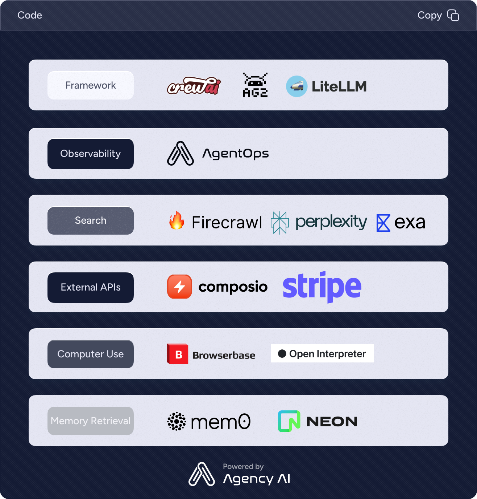

# AgentStack [](https://www.python.org/downloads/release/python-3100/) [](https://opensource.org/licenses/MIT)


Create AI agent projects from the command line.

- [Creating an Agent Project](#creating-an-agent-project) – How to create a new agent project.
- [User Guide](https://docs.agentops.ai) – How to develop agent projects bootstrapped with AgentStack.

AgentStack works on macOS, Windows, and Linux.<br>
If something doesn't work, please [file an issue](https://github.com/agentops-ai/agentops/issues/new).<br>
If you have questions or need help, please ask in our [Discord community](https://discord.gg/a4VQ23Aps5).

> 🛠️🚨 AgentStack is in open preview. We're building in public, use at your own risk but have fun :)

## Quick Overview

```sh
pip install agentstack
agentstack init
```


<p align='center'>

</p>

### Get Started Immediately

You **don't** need to install or configure tools like LangChain or LlamaIndex.<br>
They are preconfigured and hidden so that you can focus on the code.

Create a project, and you're good to go.

## Creating an Agent Project

**You'll need to have Python 3.10+ on your local development machine** (but it's not required on the server). We recommend using the latest version. You can use [pyenv](https://github.com/pyenv/pyenv) to switch Python versions between different projects.

To create a new agent project, run:

```sh
pip install agentstack
agentstack init
```

It will create a directory called `my-agent-project` inside the current folder.<br>
Inside that directory, it will generate the initial project structure and install the transitive dependencies:

```
my-agent-project/
├── README.md
├── requirements.txt
├── .gitignore
├── main.py
├── agents/
│   └── (agent files based on your setup)
└── tasks/
    └── (task files based on your setup)
```

No configuration or complicated folder structures, only the files you need to build your agent project.<br>
Once the initialization is done, you can open your project folder:

```sh
cd my-agent-project
```

Inside the newly created project, you can run some built-in commands:

### `python main.py`

Runs the agent project in development mode.<br>

## Philosophy

- **Agents should be easy:** There are so many frameworks out there, but starting from scratch is a pain. Similar to Create React App, AgentStack aims to simplify the "from scratch" process by giving you a simple boilerplate of an agent. It uses popular agent frameworks and LLM providers, but provides a cohesive curated experience on top of them.

- **No Configuration Required:** You don't need to configure anything. A reasonably good configuration of both development and production builds is handled for you so you can focus on writing code.

- **No Lock-In:** You can customize your setup at any time. AgentStack is designed to make it easy to get the components you need running right off the bat; it's up to you what to do next.

## What's Included?

Your environment will have everything you need to build a modern AI agent project:

- Support for popular agent frameworks like CrewAI, Autogen, and LiteLLM.
- Easy integration of tools for browsing, RAG, and more.
- A fast interactive test runner with built-in support for coverage reporting.
- A live development server that warns about common mistakes.
- A build script to bundle your project for production.
- Integration with [AgentOps](https://agentops.ai) for AI agent observability.
- Hassle-free updates for the above tools with a single dependency.

## Roadmap
* Frameworks
  * Autogen
  * LiteLLM
  * Swarms (OpenAI)
* Tools
  * MultiOn
  * Firecrawl
  * Anon
  * E2B
  * More
* Generated testing
* Integrated benchmarking

## License

AgentStack is open source software [licensed as MIT](LICENSE).

## How to Contribute

AgentStack is a new project built by passionate AI agent developers! We'd love help making this tool better. Easy first issues are available, create new issues with feature ideas, or chat with us on our [Discord](https://discord.gg/ahqWRGquEV).

If you are an Agent Tool developer, feel free to create an issue or even a PR to add your tool to AgentStack. 