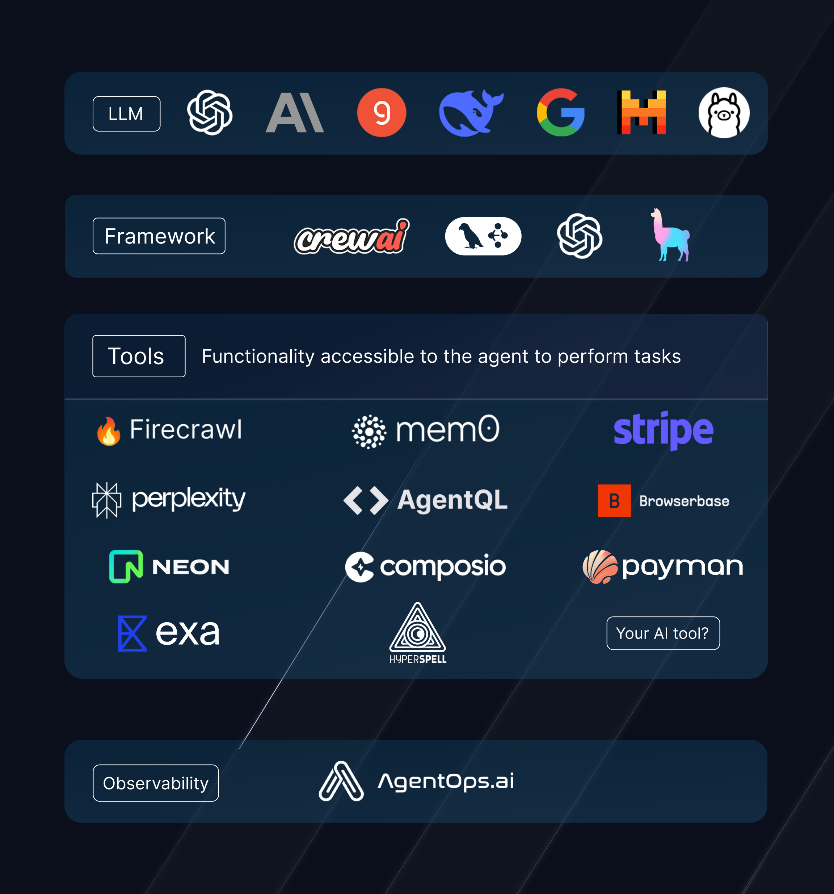

# AgentStack

 [](https://www.python.org/downloads/release/python-3100/) [](https://opensource.org/licenses/MIT)   [](https://codecov.io/github/agentops-ai/agentstack>?branch=master)


AgentStack scaffolds your _agent stack_ - The tech stack that collectively is your agent

<p align='center'>

</p>

### Install AgentStack

```sh
curl --proto '=https' --tlsv1.2 -LsSf https://install.agentstack.sh | sh
```

or python [other install methods](https://docs.agentstack.sh/installation)

### Start your agent!

Create AI agent projects from the command line.

- [Quickstart Guide](https://docs.agentstack.sh/quickstart) – How to create a new agent project.
- [Video Tutorial](https://www.loom.com/share/68d796b13cd94647bd1d7fae12b2358e?sid=7fdf595b-de84-4d51-9a81-ef1e9c8ac71c) – Follow along and build a web scrape agent with AgentStack

AgentStack works on macOS, Windows, and Linux.<br>
If something doesn't work, please [file an issue](https://github.com/agentops-ai/agentstack/issues/new).<br>
If you have questions or need help, please ask in our [Discord community](https://discord.gg/JdWkh9tgTQ).

> 🛠️🏃🏼‍♀️ The quickest way to build your powerful agent project

AgentStack serves as a great tool for starting your agent project and offers many CLI utilities for easy code-gen throughout the development process.

AgentStack is _not_ a low-code alternative to development. Developers will still need an understanding of how to build with their selected agent framework.

### Currently Supported Providers
- **LLMs**: Most all notable LLMs and providers are supported via LiteLLM or LangChain
- **Framework**: Currently supported frameworks include CrewAI, LangGraph, OpenAI Swarms and LlamaStack
  - Roadmap: Pydantic AI, Eliza, AG2 and Autogen
- **Tools**: Maintaining the largest repository of framework-agnostic tools! All tools listed [here](https://docs.agentstack.sh/tools/community)
- **Observability**: AgentOps baked in by default with first-tier support

### Get Started Immediately

You **don't** need to install or configure tools like LangChain or LlamaIndex.<br>
They are preconfigured and hidden so that you can focus on the code.

Create a project, and you're good to go.

## Creating an Agent Project

**You'll need to have Python 3.10+ on your local development machine**. We recommend using the latest version. You can use [pyenv](https://github.com/pyenv/pyenv) to switch Python versions between different projects.

To create a new agent project, run:

```sh
uv pip install agentstack # or other install method
agentstack init <project_name>
```

It will create a directory with your project name inside the current folder.<br>
Inside that directory, it will generate the initial project structure and install the transitive dependencies.

No configuration or complicated folder structures, only the files you need to build your agent project.<br>
Once the initialization is done, you can open your project folder:

```sh
cd <your_agent_project>
uv pip install
```

then run the default agent!

```sh
agentstack run
```

### Templates
Additionally, pre-built templates are available as a shortcut to building your project. [View the available templates](https://docs.agentstack.sh/templates).

## Building Agent Functionality

After generating a project, the next step is to build your agent project by creating Agents and Tasks. You can do this quickly with AgentStack:

```bash
agentstack generate agent/task <name>
```

Modify the agents and tasks by changing the `agents.yaml` and `tasks.yaml` configuration files in `src/config`

## Tooling

One of AgentStack's core principles is to establish the de facto agent _stack_. A critical component of this stack is the tooling and functionality given to agents beyond simply LLM capabilities.

AgentStack has worked to make access to tools as easy as possible, staying framework agnostic and featuring the best tools.

A list of all tools can be found [on our docs](https://docs.agentstack.sh/tools/core).

Adding tools is as simple as

```bash
agentstack tools add
```

## Running Your Agent

`agentstack run`

Runs the agent project in development mode.<br>

> 👀 Support for easy production deployment of agents is coming soon.

## Philosophy

- **Agents should be easy:** There are so many frameworks out there, but starting from scratch is a pain. Similar to `create-react-app`, AgentStack aims to simplify the "from scratch" process by giving you a simple boilerplate of an agent. It uses popular agent frameworks and LLM providers, but provides a cohesive curated experience on top of them.

- **No Configuration Required:** You don't need to configure anything. A reasonably good configuration of both development and production builds is handled for you so you can focus on writing code.

- **No Lock-In:** You can customize your setup at any time. AgentStack is designed to make it easy to get the components you need running right off the bat; it's up to you what to do next.

- **Provider Agnosticism:** AgentStack is designed to be provider agnostic in all ways. This means especially that the framework layer of your agent stack should be interoperable with every other layer. Frameworks must still be supported by AgentStack. See supported frameworks above.

AgentStack is not designed to be a low-code solution to building agents. Instead it is a great head-start for starting an agent project from scratch.

## Roadmap

### Tools
- More [core tools](https://docs.agentstack.sh/tools/core) built by AgentStack
- Preferred partners in the package directly
- Community partner tools added through external repositories

### New Stack Layers
- Prompting layer (DSPy)
- Eval Layer
- UI layer

### Other Features
- Generated testing
- Integrated benchmarking
- Easy integration of tools for browsing, RAG, and more.
- A fast interactive test runner with built-in support for coverage reporting.
- A live development server that warns about common mistakes (in progress).
- A build script to bundle your project for production (in progress).

## License

AgentStack is open source software [licensed as MIT](LICENSE).

## How to Contribute

AgentStack is a new project built by passionate AI agent developers! We'd love help making this tool better. Easy first issues are available, create new issues with feature ideas, or chat with us on our [Discord](https://discord.gg/JdWkh9tgTQ). Make sure you read our contributor documentation to familiarize yourself with the project at [How to Contribute](https://docs.agentstack.sh/contributing/how-to-contribute).

If you are an Agent Tool developer, feel free to create an issue or even a PR to add your tool to AgentStack. 
